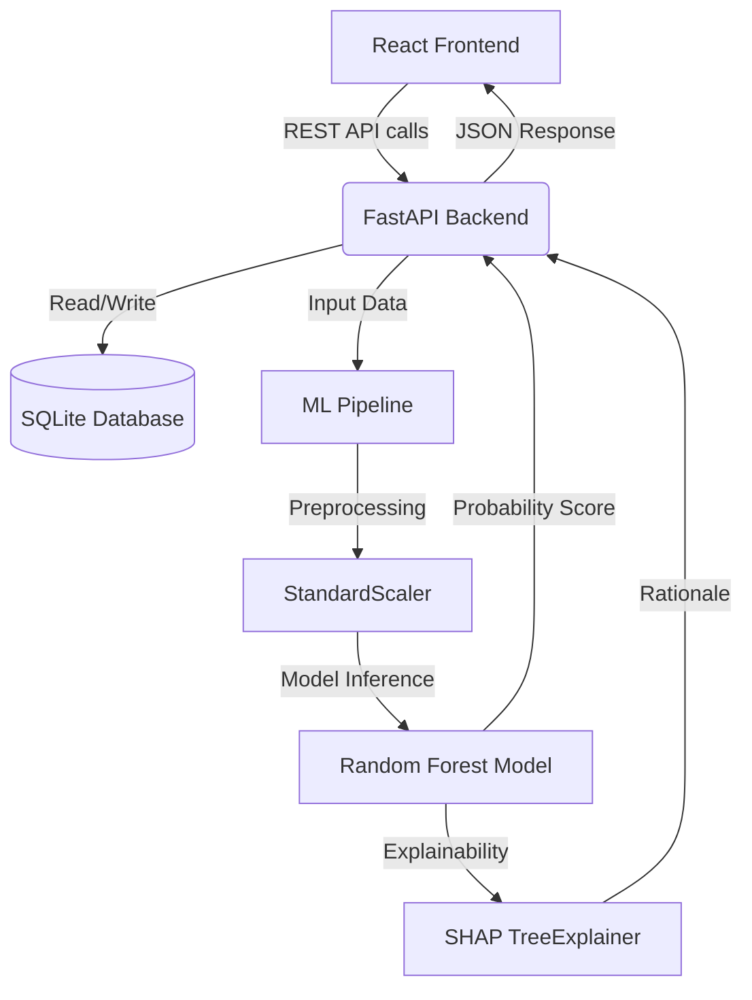

<div align="center">
  
  # 🏦 AI-Powered Loan Approval & Portfolio Analytics
  
  **An intelligent full-stack platform bridging the gap between black-box AI models and actionable financial insights.**

  [](https://www.python.org)
  [](https://fastapi.tiangolo.com/)
  [](https://reactjs.org/)
  [](https://vitejs.dev/)
  [](https://scikit-learn.org/)
  [](https://opensource.org/licenses/MIT)

</div>

---

## 📖 Table of Contents
- [About the Project](#-about-the-project)
- [Key Features](#-key-features)
- [System Architecture](#-system-architecture)
- [Technology Stack](#-technology-stack)
- [Getting Started](#-getting-started)
- [Project Structure](#-project-structure)
- [How the AI Works](#-how-the-ai-works)

---

## 🎯 About the Project

Traditional loan approval systems often rely on rigid rule-based logic or opaque machine learning models that offer no explanation for their decisions. 

This platform leverages **Machine Learning** to accurately predict loan approvals and utilizes **SHAP (SHapley Additive exPlanations)** to provide transparent, human-readable rationale for every decision. Designed for modern underwriters, it includes a comprehensive analytics dashboard to monitor portfolio health and an interactive simulator to test edge cases.

---

## ✨ Key Features

- **🧠 AI Loan Prediction:** Predicts loan approval probabilities based on an applicant's holistic financial profile (Income, CIBIL Score, Loan Amount, Dependents, Education).
- **🔍 Explainable AI (XAI):** Breaks down the positive and negative contributing factors for every application using SHAP values.
- **🎛️ What-If Simulator:** An interactive sandbox allowing loan officers to tweak an applicant's parameters (like CIBIL score or requested loan amount) in real-time to see how it affects their approval chances.
- **📊 Portfolio Analytics:** A comprehensive dashboard visualizing approval rates, feature comparisons (e.g., Average Income vs Approval Status), and overall portfolio risk distribution.
- **📈 Performance Monitoring:** Tracks model drift, data leakage, and real-time prediction accuracy to ensure the AI remains unbiased and effective.

---

## 🏗️ System Architecture



---

## 🛠️ Technology Stack

| Category | Technologies |
| --- | --- |
| **Frontend** | React 19, Vite, Recharts, Lucide React, React Router Dom |
| **Backend** | FastAPI, Uvicorn, SQLAlchemy, Pydantic |
| **Machine Learning** | Scikit-Learn, SHAP, Pandas, NumPy |
| **Database** | SQLite |

---

## 🚀 Getting Started

Follow these instructions to set up the project locally for development and testing.

### 1. Prerequisites
- **Python 3.10+**
- **Node.js 18+** & npm

### 2. Backend Setup

Navigate to the project root and install the required Python dependencies:

```bash
pip install -r requirements.txt
```

Start the FastAPI server:

```bash
cd backend
uvicorn main:app --reload --port 8000
```
> **Note:** The backend API will be running at `http://localhost:8000`. You can view the interactive API documentation at `http://localhost:8000/docs`.

### 3. Frontend Setup

Open a new terminal window, navigate to the frontend directory, and install the npm packages:

```bash
cd LoanApprovalPrediction
npm install
```

Start the Vite development server:

```bash
npm run dev
```
> **Note:** The React application will be available at `http://localhost:5173`.

---

## 📂 Project Structure

```text
Loanapprovalprediction/
├── backend/                   # ⚙️ FastAPI Backend
│   ├── routers/               # API endpoint handlers
│   ├── database.py            # Database connection setup
│   ├── models.py              # SQLAlchemy database models
│   ├── schemas.py             # Pydantic validation schemas
│   └── main.py                # FastAPI app entry point
│
├── frontend/                  # 🎨 React Frontend
│   ├── src/
│   │   ├── components/        # Reusable UI components
│   │   ├── pages/             # Main views (Dashboard, Analytics, WhatIf)
│   │   └── App.jsx            # Main React application
│   └── package.json           # Frontend dependencies
│
├── machine_learning/          # 🧠 Machine Learning Pipeline
│   ├── data/                  # raw, interim, and processed datasets
│   ├── src/                   # ML source code (predict, train, etc.)
│   └── synthesize_dataset.py  # Mock data generation script
│
├── docs/                      # 📄 Project documentation and artifacts
├── requirements.txt           # Python dependencies
├── render.yaml                # Render deployment configuration
└── README.md                  # Project documentation
```

---

## 🔬 How the AI Works

1. **Prediction Pipeline**: When an application is submitted, the backend routes the financial data to `src/predict.py`.
2. **Preprocessing**: Data passes through `preprocessing.py`, where categorical variables are encoded and numerical features are scaled (using `scaler.pkl`).
3. **Inference**: The preprocessed data is fed into the trained ML model (`loan_approval_model.pkl`) to generate an approval probability score (0-100%).
4. **SHAP Explanation**: The `TreeExplainer` calculates SHAP values, assigning a direct quantitative impact to each feature (e.g., *"-15% due to low CIBIL score"*). This rationale is instantly returned to the frontend.

---

